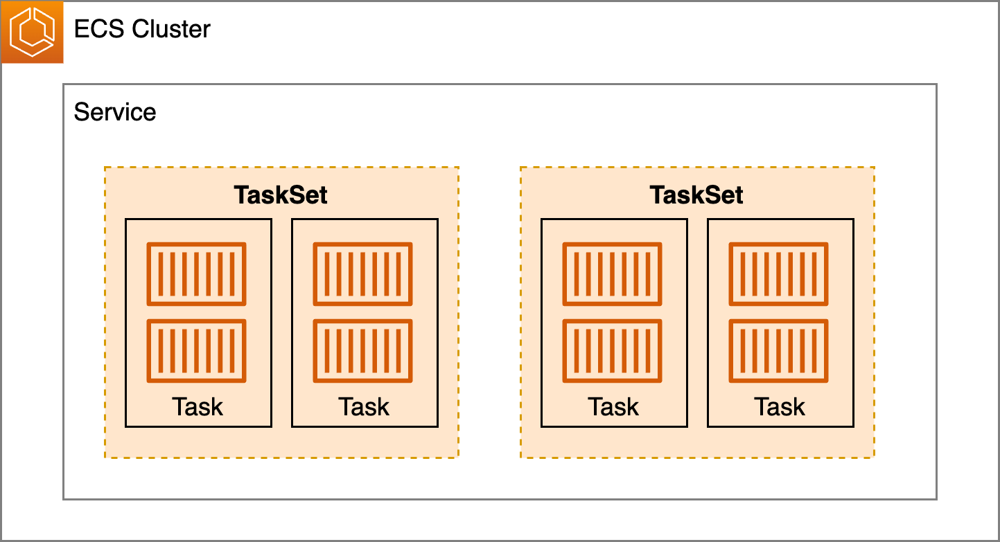
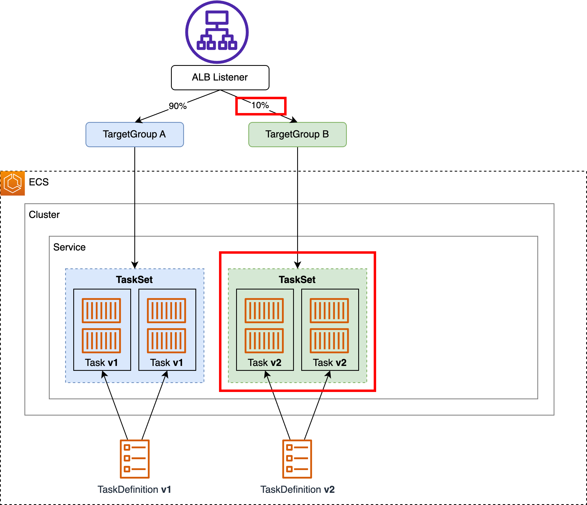
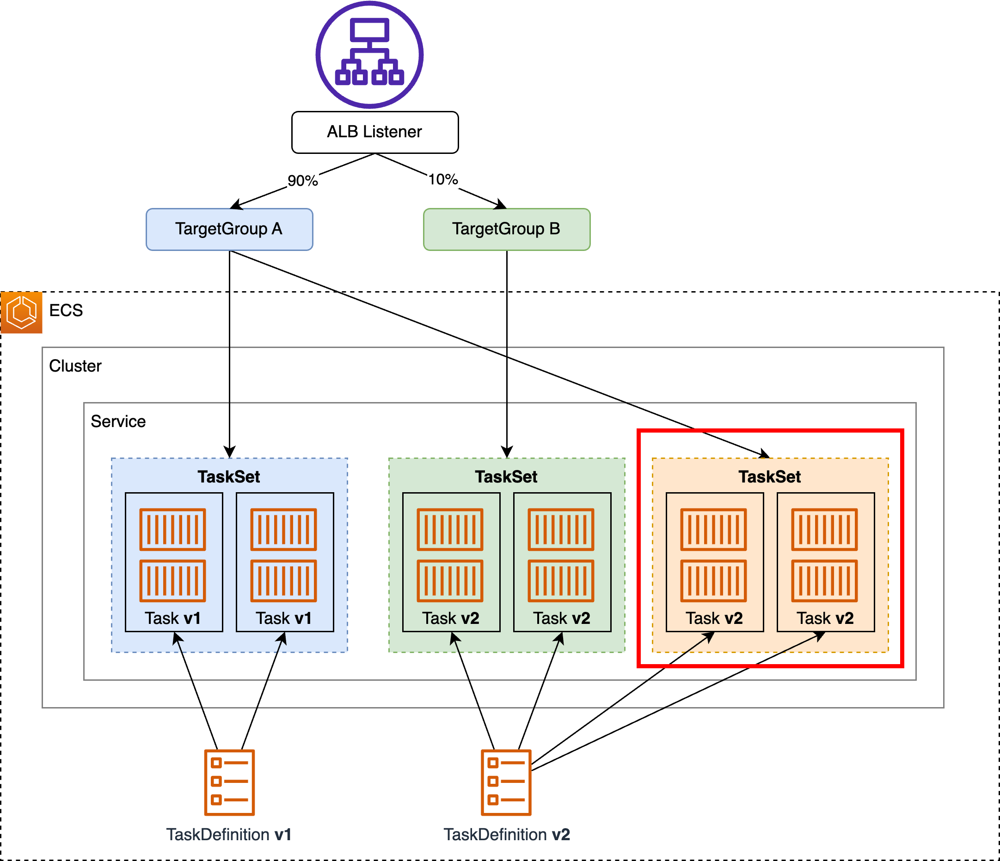
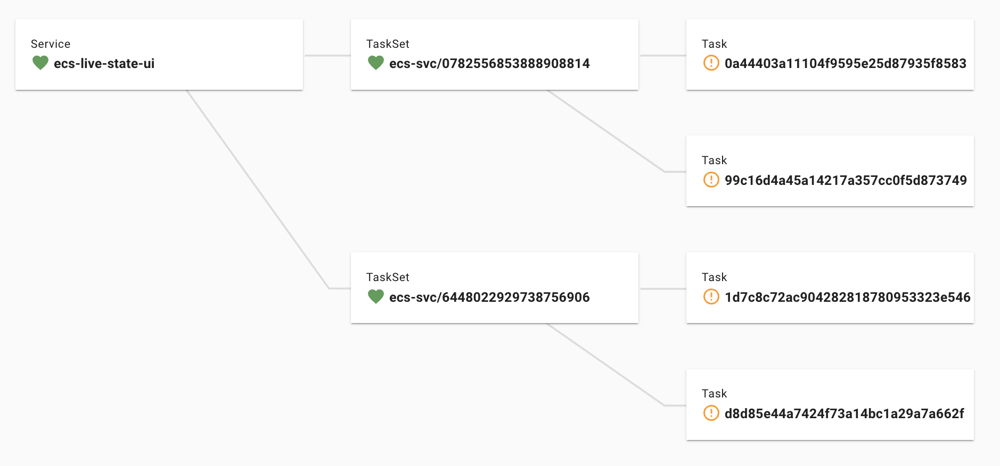

This guide explores "**External Deployment**" and "**TaskSet**" - two of the lesser-known yet powerful features in ECS. We'll cover their concepts and practical usage, including real-world examples with PipeCD. Mastering these features enables advanced deployment strategies in ECS.

*Note: This article is based on specifications as of December 14, 2024.*

# Key Takeaways

- **TaskSet**: A layer between Service and Task that maintains revisions per TaskSet
- **External Deployment**: A deployment type that enables flexible deployments using TaskSets
- These features are essential for implementing advanced deployment strategies like Canary in ECS

# Understanding the Terminology

## 1. What is External Deployment?

External Deployment is a deployment type in ECS that enables flexible deployments through third-party controllers.

https://docs.aws.amazon.com/AmazonECS/latest/developerguide/deployment-type-external.html

*Note: This is unrelated to [`launchType: EXTERNAL`](https://docs.aws.amazon.com/AmazonECS/latest/developerguide/ecs-anywhere.html) used in ECS Anywhere.*

### Three Deployment Types

ECS offers three [deployment types](https://docs.aws.amazon.com/AmazonECS/latest/APIReference/API_DeploymentController.html), with External Deployment being one of them:

- [`ECS`](https://docs.aws.amazon.com/AmazonECS/latest/developerguide/deployment-type-ecs.html): Rolling update - the default and most conventional approach
- [`CODE_DEPLOY`](https://docs.aws.amazon.com/AmazonECS/latest/developerguide/deployment-type-bluegreen.html): Integrates with CodeDeploy for straightforward Canary and Blue/Green deployments
- [**`EXTERNAL`**](https://docs.aws.amazon.com/AmazonECS/latest/developerguide/deployment-type-external.html): Enables custom deployments through TaskSet manipulation

**Important: The deployment type cannot be changed after service creation.**

### Differences between `CODE_DEPLOY` and `EXTERNAL`

- Both manipulate TaskSets and follow similar operational flows[^1]
- `CODE_DEPLOY` is easier to implement as CodeDeploy handles most operations
- `EXTERNAL` offers more flexibility despite its complexity
  - Examples: Custom deployment validation, rollback strategies

## 2. What is TaskSet?

TaskSet is a concept that sits between ECS Service and Task, grouping Tasks together.



TaskSets only appear when using CodeDeploy or External deployment types, handling Task scheduling and scaling instead of the Service.

You won't encounter TaskSets when using rolling updates or running [Standalone Tasks](https://docs.aws.amazon.com/AmazonECS/latest/developerguide/standalone-tasks.html).

### Examining TaskSets

TaskSets aren't visible in the console. You can view them by using [`DescribeServices`](https://docs.aws.amazon.com/AmazonECS/latest/APIReference/API_DescribeServices.html) on a Service using CodeDeploy or External deployment. They have similar attributes to Services, including `runningCount`, `launchType`, and `networkConfiguration`.

```json
$ aws ecs describe-services --cluster xxx --services yyy-service
{
    "services": [
        {
            "serviceName": "yyy-service",
            "taskSets": [ // Here
                {
                    "id": "ecs-svc/4390851359570905103",
                    "taskSetArn": "arn:aws:ecs:ap-northeast-1:<account>:task-set/xxx/yyy-service/ecs-svc/4390851359570905103",
                    "serviceArn": "arn:aws:ecs:ap-northeast-1:<account>:service/xxx/yyy-service",
                    "clusterArn": "arn:aws:ecs:ap-northeast-1:<account>:cluster/xxx",
                    "status": "ACTIVE",
                    "taskDefinition": "arn:aws:ecs:ap-northeast-1:<account>:task-definition/zzz-taskdef:1",
                    "computedDesiredCount": 2,
                    "pendingCount": 2,
                    "runningCount": 0,
                    "createdAt": "2024-12-13T20:00:24.064000+09:00",
                    "updatedAt": "2024-12-13T20:00:28.178000+09:00",
                    "launchType": "FARGATE",
                    "platformVersion": "1.4.0",
                    "platformFamily": "Linux",
                    "networkConfiguration": {
                        "awsvpcConfiguration": {
                            "subnets": [
                                "subnet-aaa",
                                "subnet-bbb"
                            ],
                            "securityGroups": [
                                "sg-ccc"
                            ],
                            "assignPublicIp": "DISABLED"
                        }
                    },
                    "loadBalancers": [],
                    "serviceRegistries": [],
                    "scale": {
                        "value": 100.0,
                        "unit": "PERCENT"
                    },
                    "stabilityStatus": "STABILIZING",
                    "stabilityStatusAt": "2024-12-13T20:00:24.064000+09:00",
                    "tags": []
                }
            ],
            "deploymentController": {
                "type": "EXTERNAL" // External deployment
            },
            ...
        }
    ],
}
```

### When to Use TaskSets

TaskSets enable Canary releases and Blue/Green deployments because you can **specify different TargetGroups and TaskDefinitions per TaskSet**:
- "TaskSet with v1 TaskDefinition points to TargetGroup A"
- "TaskSet with v2 TaskDefinition points to TargetGroup B"

Control traffic distribution between TargetGroups at the ALB level.


*Canary release and Blue/Green deployment using TaskSets*

### TaskSet Operations

There are only five APIs for TaskSet operations. Most operations involve managing multiple TaskSets rather than modifying a single TaskSet's internals.

1. [`CreateTaskSet`](https://docs.aws.amazon.com/AmazonECS/latest/APIReference/API_CreateTaskSet.html)
2. [`DescribeTaskSets`](https://docs.aws.amazon.com/AmazonECS/latest/APIReference/API_DescribeTaskSets.html)
   - Requires TaskSet ID beforehand, making it cumbersome
   - [`DescribeServices`](https://docs.aws.amazon.com/AmazonECS/latest/APIReference/API_DescribeServices.html) is recommended for easier TaskSet information retrieval
3. [`DeleteTaskSet`](https://docs.aws.amazon.com/AmazonECS/latest/APIReference/API_DeleteTaskSet.html)
4. [`UpdateTaskSet`](https://docs.aws.amazon.com/AmazonECS/latest/APIReference/API_UpdateTaskSet.html)
   - Can only update **[`scale`](https://docs.aws.amazon.com/AmazonECS/latest/APIReference/API_Scale.html)**
     - `scale`: Percentage of Tasks to run in this TaskSet relative to Service's `desiredCount`
       - Example: With `desiredCount` 10 and `scale` 30%, TaskSet maintains 3 Tasks
       - Range: 0-100
     - Task count automatically adjusts when Service autoscales (changes in `desiredCount`)
   - Cannot update **`taskDefinition`**, ensuring all Tasks within a TaskSet use the same image with immutable tags
5. [`UpdateServicePrimaryTaskSet`](https://docs.aws.amazon.com/AmazonECS/latest/APIReference/API_UpdateServicePrimaryTaskSet.html)
   - Changes a TaskSet's [`status`](https://docs.aws.amazon.com/AmazonECS/latest/APIReference/API_TaskSet.html#ECS-Type-TaskSet-status) to `PRIMARY`
   - Optional but recommended as **Primary TaskSet cannot be deleted with `DeleteTaskSet`**[^2]
   - Making a TaskSet Primary changes the previous Primary TaskSet to `ACTIVE`
   - Some Primary TaskSet settings propagate to Service (`launchType`, `taskDefinition`, etc.)

     - Before Primary TaskSet exists:

         ```json
         $ aws ecs describe-services --cluster xxx --services yyy-service
         {
             "services": [
                 {
                     "serviceName": "yyy-service",
                     "launchType": "EC2", // Initial Service creation
                     "taskSets": [
                         {
                             "id": "ecs-svc/8721983045402263235",
                             "status": "ACTIVE", // Not PRIMARY yet
                             "taskDefinition": "arn:aws:ecs:ap-northeast-1:<account>:task-definition/zzz-taskdef:3",
                             "launchType": "FARGATE",
                             ...
         ```

     - After `UpdateServicePrimaryTaskSet`:

         ```json
         $ aws ecs describe-services --cluster xxx --services yyy-service
         {
             "services": [
                 {
                     "serviceName": "yyy-service",
                     "launchType": "FARGATE", // Propagated from TaskSet
                     "taskDefinition": "arn:aws:ecs:ap-northeast-1:<account>:task-definition/zzz-taskdef:3", // Propagated from TaskSet
                     "taskSets": [
                         {
                             "id": "ecs-svc/8721983045402263235",
                             "status": "PRIMARY", // Now PRIMARY
                             "taskDefinition": "arn:aws:ecs:ap-northeast-1:<account>:task-definition/zzz-taskdef:3",
                             "launchType": "FARGATE",
                             ...
         ```

[^2]: `DeleteTaskSet` will return this error: `An error occurred (InvalidParameterException) when calling the DeleteTaskSet operation: Primary TaskSet cannot be deleted`

# Example: Canary Release with External Deployment

There are multiple approaches to External Deployment, including rollback strategies.
Here are two examples.
For more details, refer to [this documentation](https://docs.aws.amazon.com/AmazonECS/latest/developerguide/deployment-type-external.html#deployment-type-external-workflow).

**Note:** This article focuses on Services behind ALB.

## Method A: Promoting Canary to Primary

### Prerequisites

Assume ALB, ListenerRule, two TargetGroups, ECS Cluster, and TaskDefinitions (v1,v2) are ready

#### Step 1: Create Service

Use [`CreateService`](https://docs.aws.amazon.com/AmazonECS/latest/APIReference/API_CreateService.html) to create a Service.

- [Required] Set [`deploymentController.type`](https://docs.aws.amazon.com/AmazonECS/latest/APIReference/API_DeploymentController.html#ECS-Type-DeploymentController-type) to `EXTERNAL`

- Fewer required parameters compared to `ECS` deployment type
  - No need for `taskDefinition`, `launchType`, `networkConfiguration`
  - Details [here](https://docs.aws.amazon.com/AmazonECS/latest/developerguide/deployment-type-external.html#deployment-type-external-workflow)

```sh
$ aws ecs create-service \
--cluster <cluster-name> \
--service-name <service-name> \
--desired-count 2 \
--deployment-controller type=EXTERNAL
```

No TaskSets or Tasks are created at this point.

#### Step 2: Create Initial TaskSet (v1)

Use [`CreateTaskSet`](https://docs.aws.amazon.com/AmazonECS/latest/APIReference/API_CreateTaskSet.html) to create the first TaskSet.

- Specify parameters typically set at Service level (`launchType`, `taskDefinition`, etc.)
- [`loadBalancers[].targetGroupArn`](https://docs.aws.amazon.com/AmazonECS/latest/APIReference/API_LoadBalancer.html#ECS-Type-LoadBalancer-targetGroupArn): Specify TargetGroup for ALB traffic
- Recommend 100% `scale` for initial TaskSet

```sh
$ aws ecs create-task-set \
--cluster <cluster-name> \
--service <service-name> \
--task-definition <task-def-arn-v1> \
--launch-type FARGATE \
--network-configuration "awsvpcConfiguration={subnets=[subnet-aaa,subnet-bbb],securityGroups=[sg-ccc],assignPublicIp=ENABLED}" \
--load-balancers "targetGroupArn=<tg-arn-1>,containerName=web,containerPort=80" \ # Match TaskDefinition
--scale unit=PERCENT,value=100
```


*After prerequisites*

*Note: `UpdateServicePrimaryTask` is optional here*

### Deployment Flow

#### 1. Create TaskSet (v2)

Similar to Step 2 above, but with different `task-definition`, `targetGroupArn`, and `scale`.

```sh
$ aws ecs create-task-set \
--cluster <cluster-name> \
--service <service-name> \
--task-definition <task-def-arn-v2> \
--launch-type FARGATE \
--network-configuration "awsvpcConfiguration={subnets=[subnet-aaa,subnet-bbb],securityGroups=[sg-ccc],assignPublicIp=ENABLED}" \
--load-balancers "targetGroupArn=<tg-arn-2>,containerName=web,containerPort=80" \ # Match TaskDefinition
--scale unit=PERCENT,value=10
```

No traffic flows to v2 TaskSet yet as its TargetGroup weight is 0.


*Creating Canary TaskSet*

#### 2. Route Traffic to Canary

Use ELB's [`ModifyRule`](https://docs.aws.amazon.com/elasticloadbalancing/latest/APIReference/API_ModifyRule.html) to adjust TargetGroup weights.

```sh
$ aws elbv2 modify-rule \
--rule-arn <listener-rule-arn> \
--actions '[{
    "Type": "forward", 
    "ForwardConfig": {
        "TargetGroups": [
            {
                "TargetGroupArn": "<tg-arn-1>", 
                "Weight": 90
            },
            {
                "TargetGroupArn": "<tg-arn-2>", 
                "Weight": 10
            }
        ]
    }
}]' 
```


*Starting traffic flow to Canary*

Use [`ModifyListener`](https://docs.aws.amazon.com/elasticloadbalancing/latest/APIReference/API_ModifyListener.html) for default listener rules.
For multiple ListenerRules, gather all target rules beforehand.

#### 3. If Successful, Route 100% Traffic to Canary

*Note: If Canary's `scale` was less than 100, first use `UpdateTaskSet` to set it to 100.*

Use ELB's [`ModifyRule`](https://docs.aws.amazon.com/elasticloadbalancing/latest/APIReference/API_ModifyRule.html) again to update TargetGroup weights.
  
```sh
$ aws elbv2 modify-rule \
--rule-arn <listener-rule-arn> \
--actions '[{
    "Type": "forward", 
    "ForwardConfig": {
        "TargetGroups": [
            {
                "TargetGroupArn": "<tg-arn-1>", 
                "Weight": 0
            },
            {
                "TargetGroupArn": "<tg-arn-2>", 
                "Weight": 100
            }
        ]
    }
}]' 
```


*Routing 100% traffic to Canary*

#### 4. Promote Canary TaskSet to Primary

#### 4.1. Get Canary TaskSet ID

```sh
$ aws ecs describe-services \
--cluster <cluster-name> \
--services <service-name> \
| jq '.services[0].taskSets[]'    
```

Find Canary TaskSet ID in response, using `status` (`PRIMARY`/`ACTIVE`) to identify it.

#### 4.2. Use [`UpdateServicePrimaryTaskSet`](https://docs.aws.amazon.com/AmazonECS/latest/APIReference/API_UpdateServicePrimaryTaskSet.html) to Make Canary TaskSet Primary

```sh
$ aws ecs update-service-primary-task-set \
--cluster <cluster-name> \
--service <service-name> \
--primary-task-set <ecs-svc/xxx> # Canary TaskSet ID from 4.1
```

#### 5. Delete Old TaskSet

Use [`DeleteTaskSet`](https://docs.aws.amazon.com/AmazonECS/latest/APIReference/API_DeleteTaskSet.html) to remove v1 TaskSet.

```sh
$ aws ecs delete-task-set \
--cluster <cluster-name> \
--service <service-name> \
--task-set <ecs-svc/xxx> # Old TaskSet ID from 4.1
```


*After deployment completion*

### Rollback Scenarios

- If failure occurs during steps 2 or 3:
  1. Return 100% traffic to TargetGroup A
  2. Delete Canary TaskSet

- If failure occurs during step 5:
  1. Create new TaskSet using TaskDefinition v1 and TargetGroup A
  2. Update it to Primary
  3. Route 100% traffic to TargetGroup A
  4. Delete Canary TaskSet

### Method A Challenges

TargetGroup assignments to old/new TaskSets aren't fixed, requiring tracking of current assignments.
This complicates rollback especially.

## Method B: Using Three TaskSets

Here's an alternative approach that addresses Method A's challenges.
It uses three TaskSets: "current", "canary", and "new".

This is the approach PipeCD adopts.

### Deployment Flow

#### 0. Initial State


#### 1. Create Canary

Use `CreateTaskSet` and `elbv2::ModifyRule`.
Canary TaskSet's `scale` can be less than 100%.



#### 2. If Successful, Create New TaskSet

Use `CreateTaskSet` with TargetGroup A and TaskDefinition v2.



Traffic now flows to the third TaskSet.

#### 3. Delete All Old TaskSets

Use `UpdateServicePrimaryTaskSet`, `elbv2::ModifyRule`, and `DeleteTaskSet`.


Back to initial state configuration.
Next deployment starts with TargetGroup A pointing to latest version.

### Rollback Scenarios

- For any failure phase, return to initial state:

  1. Create new TaskSet with TaskDefinition v1 and TargetGroup A
  2. Update it to Primary
  3. Route 100% traffic to TargetGroup A
  4. Delete all other TaskSets

- For failures before step 3, faster rollback:

  1. Route 100% traffic to TargetGroup A
  2. Delete all other TaskSets

### Pros/Cons

Pros:
- Fixed TargetGroup assignments simplify operations

Cons:
- Longer deployment time due to two TaskSet creations
- Higher cost with three TaskSets

### Works on EC2 Too

Method B works on EC2 as well as Fargate.

- Initially concerned about [`deploymentConfiguration.maximumPercent`](https://docs.aws.amazon.com/AmazonECS/latest/APIReference/API_DeploymentConfiguration.html#ECS-Type-DeploymentConfiguration-maximumPercent) limitations
- Worried about "Can't use Method B if limited to 2x `desiredCount` Tasks", but `maximumPercent` is ignored
- *Note: Docs explicitly state that `maximumPercent` is ignored for External Deployment on Fargate*

### Using Method B with PipeCD

External Deployment can be complex (especially with rollbacks).
PipeCD implements Method B Canary releases with simple pipeline definitions.
Handles rollbacks automatically.

```yaml
  pipeline:
    stages:
      # 1. Create Canary TaskSet
      - name: ECS_CANARY_ROLLOUT 
        with:
          scale: 10
      # 2. Route 10% traffic to Canary
      - name: ECS_TRAFFIC_ROUTING 
        with:
          canary: 10
      # 3. Approval phase
      - name: WAIT_APPROVAL
      # 4. Create new Primary TaskSet
      - name: ECS_PRIMARY_ROLLOUT 
      # 5. Route 100% traffic to new Primary TaskSet
      - name: ECS_TRAFFIC_ROUTING 
        with:
          primary: 100
       # 6. Delete unnecessary TaskSets
      - name: ECS_CANARY_CLEAN
```
Full configuration file [here](https://github.com/pipe-cd/examples/blob/master/ecs/canary/app.pipecd.yaml).

# Important Considerations for External Deployment

Several important points to consider when using External Deployment.

#### Many Service Features/Settings Unsupported

- Examples of unsupported features:
  - [**Service Connect**](https://docs.aws.amazon.com/AmazonECS/latest/developerguide/service-connect-concepts-deploy.html#service-connect-considerations)
  - [**VPC Lattice**](https://docs.aws.amazon.com/AmazonECS/latest/developerguide/ecs-vpc-lattice.html#ecs-lattice-compatibility) (possible via Internal-ALB)
  - [Deployment Circuit Breaker](https://docs.aws.amazon.com/AmazonECS/latest/developerguide/deployment-circuit-breaker.html)
  - [Deployment Alarms](https://docs.aws.amazon.com/AmazonECS/latest/developerguide/deployment-alarm-failure.html)

- No comprehensive list of unsupported features exists
  - Recommend searching docs for keywords like "Deployment"
  - Service Connect example:
    > Only services that use rolling deployments are supported with Service Connect.

- No known TaskDefinition-specific constraints for External Deployment

#### External Deployment Often Excluded from ECS Updates

- November 2024's ["Improved Deployment Visibility"](https://aws.amazon.com/blogs/news/improving-deployment-visibility-for-amazon-ecs-services/) enhanced ECS deployment history UI/API, but External Deployment remained unchanged
- November 2024's [VPC Lattice-ECS native integration](https://aws.amazon.com/about-aws/whats-new/2024/11/amazon-vpc-lattice-elastic-container-service/) still requires Internal-ALB for External Deployment

#### Migration from Other Deployment Types is Challenging

- As mentioned, deployment type can't be changed after Service creation **(particularly painful)**
  - Migrating to External Deployment requires creating new Service and gradually shifting traffic
- Many unsupported features mean **reviewing Service settings**
  - Some settings move from `CreateService` to `CreateTaskSet`

#### Manual TaskSet Tagging Required

- TaskSet doesn't support tag propagation ([`propagateTags`](https://docs.aws.amazon.com/AmazonECS/latest/APIReference/API_CreateService.html#ECS-CreateService-request-propagateTags)) from Service/TaskDefinition [reference](https://docs.aws.amazon.com/AmazonECS/latest/developerguide/ecs-using-tags.html#tag-resources)
- [`enableECSManagedTags`](https://docs.aws.amazon.com/AmazonECS/latest/APIReference/API_Service.html#ECS-Type-Service-enableECSManagedTags) doesn't apply Managed tags to TaskSets

#### Limited Console Information

- TaskSets not visible in ECS console, requiring CLI usage
- "Deployment History" remains unchanged for External Deployment

- Reference: PipeCD visualizes Service/TaskSet/Task states in UI [^3]
  
  *PipeCD UI (during Canary deployment)*

[^3]: https://pipecd.dev/docs/user-guide/managing-application/application-live-state/

#### Other Constraints

- [Can't link multiple TargetGroups to one TaskSet](https://docs.aws.amazon.com/AmazonECS/latest/developerguide/register-multiple-targetgroups.html#multiple-targetgroups-considerations)
- Maximum 5 TaskSets per Service
  - Allows up to 5x `desiredCount` Tasks per Service (scale100 x 5 TaskSets)
  - Not documented
  - Attempting to exceed limit results in:
    ```sh
    An error occurred (InvalidParameterException) when calling the CreateTaskSet operation: 5 deployments exist on the service. Unable to create new TaskSet since this exceeds the maximum limit.
    ```

# Additional Notes

### Note 1: Why Low Awareness?

Two hypotheses for External Deployment and TaskSet's low recognition:

1. Minimal console presence

*Service creation screen - "External Deployment" not visible*

1. Satisfaction with `ECS`/`CODE_DEPLOY` deployment types (*but are they truly sufficient?*)

### Note 2: Do TaskSets Exist in `ECS` Deployment Type?

**A: Possibly used internally, but unclear**

Two hints suggest TaskSet-like behavior:

1. Task's `StartedBy` format matches External Deployment's `ecs-svc/xxx`
   - TaskSet IDs use `ecs-svc/xxx` format, and Tasks within TaskSets show this as `StartedBy`
1. The `xxx` in `ecs-svc/xxx` matches [service revision](https://docs.aws.amazon.com/AmazonECS/latest/developerguide/service-revision.html) ID

Service revision mechanism seems similar to TaskSets but has different ARN format.

`DescribeTaskSets` on `ecs-svc/xxx` fails:

```sh
$ aws ecs describe-task-sets --cluster aaa --service bbb --task-sets ecs-svc/xxx

An error occurred (InvalidParameterException) when calling the DescribeTaskSets operation: Amazon ECS only supports task set management on services configured to use external deployment controllers.
```

# Conclusion

External Deployment, while sparsely documented and constrained, is powerful when mastered.
Service Connect and VPC Lattice support would be welcome additions.

While migrating to External Deployment is challenging, PipeCD will soon support other deployment types through "plugins".
For plugin details, see:

https://pipecd.dev/blog/2024/11/28/overview-of-the-plan-for-pluginnable-pipecd/
