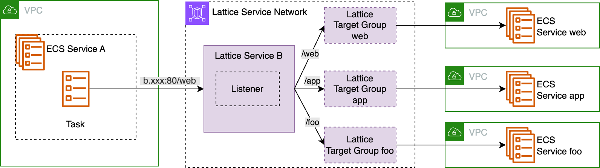

_This article is translated from [my original article](https://zenn.dev/cadp/articles/ecs-service-mesh-compare) in Japanese._

# Introduction

This article compares five options for ECS service-to-service communication: **ALB, VPC Lattice, ECS Service Discovery, ECS Service Connect, and App Mesh (scheduled for deprecation)**.

### Background

Following the [App Mesh deprecation announcement](https://aws.amazon.com/blogs/containers/migrating-from-aws-app-mesh-to-amazon-ecs-service-connect/) and VPC Lattice enhancements at re:Invent 2024 ([ECS native integration](https://aws.amazon.com/jp/about-aws/whats-new/2024/11/amazon-vpc-lattice-elastic-container-service/), [TCP support](https://aws.amazon.com/about-aws/whats-new/2024/12/vpc-lattice-tcp-vpc-resources/)), I wanted to provide an overview of the future landscape of ECS interservice communication.

_This article is based on specifications as of December 18, 2024._

# Summary

|                                 | ALB                                | VPC Lattice                               | ECS Service Discovery          | ECS Service Connect               | App Mesh (Deprecated)       |
| ------------------------------- | ---------------------------------- | ----------------------------------------- | ------------------------------ | --------------------------------- | --------------------------- |
| In short                        | Stable & versatile                 | Evolution of ALB that connects everything | Simple name resolution         | ECS-specific, easy & feature-rich | Complex & feature-rich mesh |
| Release (GA)                    | 2016                               | 2023                                      | 2018                           | 2022                              | 2019                        |
| Ease of setup & management      | Medium                             | Medium                                    | 👍👍Easy                     | 👍Relatively easy                | 👿👿Complex               |
| 💰Cost                         | Time + LCU                         | Time + traffic + request count            | 👍👍Very cost-effective      | Sidecar                           | Sidecar                     |
| 🔭Logs & Metrics               | 👍Supported                       | 👍Supported                              | 👿None                        | 👍Supported                      | 👍Supported                |
| 🔭Tracing                      | 👿None                            | 👿None                                   | 👿None                        | 👿None                           | 👍Supported                |
| 🛡️Health Check               | 👍Supported                       | 👍Supported                              | 👍Supported (container level) | 👍Partially supported[^1]        | 👍Supported                |
| 🛡️Auto Retry                 | 👿None                            | 👿None                                   | 👿None                        | 👍Supported                      | 👍Supported                |
| 🛡️Circuit Breaker            | 👿None                            | 👿None                                   | 👿None                        | Partial (outlier detection)    | 👍Supported                |
| 🚢Supported Deployment Types   | 👍All                             | Technically all                           | 👍All                         | 👿`ECS` only                     | 👍All                      |
| 🚢Canary Deployment            | 👍Easy                            | 👍Easy                                   | 👿Tricky                      | 👿Not possible                   | 👍Easy                     |
| 🐙Name Resolution from non-ECS | 👍Possible                        | 👍Possible                               | 👍Possible                    | 👿Not possible                   | 👍Possible                 |
| 🐙Cross-VPC Communication      | 👍Possible (requires VPC Peering) | 👍👍Specialty                           | 👿Not possible                | 👍Possible                       | 👍Possible                 |
| 🐙Cross-Account Communication  | 👍Possible (requires VPC Peering) | 👍👍Specialty                           | 👿Not possible                | 👿Not possible                   | 👍Possible                 |

[^1]: Currently, there are cases where "routing occurs before tasks become HEALTHY" https://github.com/aws/containers-roadmap/issues/2334

Here are some example selection criteria:

* "I want something with decent features, familiar, and won't disappear"
    -> **ALB**
* "I use various services like EKS and Lambda besides ECS, and want to connect many VPCs/accounts"
    -> **VPC Lattice**
* "Simple name resolution is enough. Reliability and observability are not needed or will be implemented separately"
    -> **Service Discovery**
* "I want to connect ECS services with high reliability and observability. Communication with non-ECS services is minimal"
    -> **Service Connect**
* "I have many microservices and strong requirements for reliability and observability. Need to connect non-ECS services too"
    -> **App Mesh** (Scheduled for deprecation, so consider VPC Lattice or Service Connect)

# What is ECS Interservice Communication?

It refers to communication between ECS services.

It's not just about "how to find the access target" but also includes considerations like "what to do if the target is down" and "how to observe the communication".

In reality, there are cases where Lambda or EC2 needs to access ECS, so we'll touch on this as one of the comparison points.

# Overview of Each Method

## 1. ALB

ALB is an L7 load balancer that can also connect to non-ECS services.
Its main strengths are being the most "mature" with abundant information and the confidence that "ALB won't be discontinued".

### Connection Method

Create an ALB for service-to-service communication and access it using its domain name.

You can set multiple path-based routing rules on the ALB to avoid creating many ALBs.

_Example: `/web` routes to service-web, `/app` routes to service-app_

## 2. VPC Lattice

VPC Lattice is an application connectivity service that abstracts ALB functionality, which became GA in March 2023.
It can connect EC2, EKS, and Lambda, with cross-VPC and cross-account communication as its key strengths.

### Connection Method

Access using the Lattice Service domain name + port,
which routes to ECS services associated with the Lattice Target Group defined in the Listener.

_ECS Service Integration via VPC Lattice_

* Lattice Service Network: Logical collection of Lattice Services
* Lattice Service: Similar to "one ALB", can have domain name and **multiple Listeners**
* Lattice Target Group: Almost the same as ELB target groups, but not compatible

#### Before Native ECS Integration
Previously, ALB was required in front of ECS, but this became unnecessary with the [November 18, 2024 update](https://aws.amazon.com/about-aws/whats-new/2024/11/amazon-vpc-lattice-elastic-container-service/?nc1=h_ls).

_Previously: ALB was required in front of ECS_

#### Associating Multiple ECS Services
Each Listener can have multiple ListenerRules like ALB.
By setting path-based routing, you can associate multiple ECS services with one Lattice Service.

_Associating multiple ECS services with one Lattice Service_

This improves manageability and potentially reduces costs.
As [discussed later](#cost-case-by-case), there's a time-based charge per Lattice Service.

### Other Features

* IAM authentication can be used to restrict communication sources.
  * https://docs.aws.amazon.com/vpc-lattice/latest/ug/auth-policies.html
* TCP support allows access to DBs etc. (though expensive)
  * https://aws.amazon.com/about-aws/whats-new/2024/12/vpc-lattice-tcp-vpc-resources/

## 3. ECS Service Discovery

ECS Service Discovery provides a simple name resolution mechanism.
While it lacks reliability and observability features, it offers simplicity and cost-effectiveness.

https://docs.aws.amazon.com/AmazonECS/latest/developerguide/service-discovery.html

### Connection Method

1. Client resolves `<service namespace>.<hosted-zone name>` to get backend Task IP addresses
2. Access using those IP addresses

Unlike other methods, containers can communicate directly with target services.

## 4. ECS Service Connect

Service Connect, launched in November 2022, combines features from ELB, Service Discovery, and App Mesh.
It specializes in ECS-to-ECS communication and provides easy setup for reliability and observability features.

### Connection Method

An Envoy-based sidecar container ([Service Connect Agent](https://github.com/aws/amazon-ecs-service-connect-agent)) handles communication.
It automatically handles Cloud Map registration, target discovery via Cloud Map, and access.

### Side Note: Integration with Lambda and VPC Lattice

There are requests to integrate Service Connect with [Lambda](https://github.com/aws/containers-roadmap/issues/1960) and [VPC Lattice](https://github.com/aws/containers-roadmap/issues/2149).
While this might be challenging due to architectural and conceptual reasons, if realized, it would significantly expand Service Connect's possibilities.

## 5. App Mesh (Scheduled for Deprecation)

App Mesh is a feature-rich service mesh service consisting of [1]managed Envoy control plane and [2]Envoy sidecar containers.

It's scheduled for deprecation by September 30, 2026. Two migration paths are recommended:
* [Migration to Service Connect](https://aws.amazon.com/blogs/containers/migrating-from-aws-app-mesh-to-amazon-ecs-service-connect/)
* [Migration to VPC Lattice](https://aws.amazon.com/blogs/containers/migrating-from-aws-app-mesh-to-amazon-vpc-lattice/)

### Connection Method

Like Service Connect, the sidecar handles various tasks.
Since it's scheduled for deprecation, we'll omit detailed mechanism explanations.

# Comparison by Aspect

From here, we'll mostly exclude App Mesh.
It's scheduled for deprecation and is generally powerful except for its complexity.

## Cost💰

|      | ALB        | VPC Lattice                    | 👑ECS Service Discovery  | ECS Service Connect | App Mesh |
| ---- | ---------- | ------------------------------ | ------------------------- | ------------------- | -------- |
| Cost | Time + LCU | Time + traffic + request count | 👍👍Very cost-effective | Sidecar             | Sidecar  |

* Service Discovery is extremely cost-effective as it doesn't require sidecars
* ALB requires complex cost calculations based on LCU
* VPC Lattice has time-based charges per Lattice Service
  * Time-based charges alone cost approximately $23.4 per month per Service (\$0.0325/h x 24 x 30)
  * For cost efficiency, it's better to associate multiple ECS services with one Lattice Service rather than creating a separate Lattice Service per ECS service (similar to ALB)
* Service Connect charges for sidecar resources
  * With minimum recommended specs for x86 Fargate, it costs about $9.1 per task per month (\$0.05056/h x 0.25 x 24 x 30)[^2]
  * Of course, larger sizes may be needed depending on traffic
  * May be cost-prohibitive with many tasks

[^2]:Minimum 256CPU(=0.25vCPU) and 64MiB additional resources per task are recommended for sidecars. https://docs.aws.amazon.com/AmazonECS/latest/developerguide/service-connect-concepts-deploy.html#service-connect-concepts-proxy

## Observability🔭

|                | ALB                      | VPC Lattice  | ECS Service Discovery | ECS Service Connect | App Mesh     |
| -------------- | ------------------------ | ------------ | --------------------- | ------------------- | ------------ |
| Logs & Metrics | 👍Supported             | 👍Supported | 👿None               | 👍Supported        | 👍Supported |
| Tracing        | 👿None (ID is assigned) | 👿None      | 👿None               | 👿None             | 👍Supported |

* Service Discovery is designed without observability features, and this is unlikely to change
* Tracing is App Mesh's specialty, with Envoy sidecars capable of sending data to X-Ray or Datadog
* Service Connect, being Envoy-based, might support tracing in the future
  * There are feature requests for this
    https://github.com/aws/containers-roadmap/issues/2369
* ALB adds `X-Amzn-Trace-Id` to request headers, but this alone doesn't enable rich distributed tracing

## Reliability🛡️

|                 | ALB              | VPC Lattice  | ECS Service Discovery             | 👑ECS Service Connect     | App Mesh     |
| --------------- | ---------------- | ------------ | --------------------------------- | -------------------------- | ------------ |
| Health Check    | 👠Supported | 👍Supported | 👍Supported (container level) | 👍Partially supported[^1] | 👍Supported |
| Auto Retry      | 👿 None      | 👿None      | 👿None                           | 👍Supported               | 👍Supported |
| Circuit Breaker | 👿 None      | 👿None      | 👿None                           | Partial(outlier detection) | 👍Supported |

* Health checks are essential, but auto retry and circuit breakers aren't mandatory
* Service Connect has advantages in auto retry and outlier detection
  * Auto retry retries on different tasks if the original task fails
* App Mesh's circuit breaker consists of **[1]outlier detection** + **[2]connection pool**
  * Outlier detection([outlier detection](https://www.envoyproxy.io/docs/envoy/latest/intro/arch_overview/upstream/outlier)): Monitors actual traffic to stop routing to hosts with many errors
  * Connection pool: Limits concurrent connections or requests

https://aws.amazon.com/about-aws/whats-new/2020/11/aws-app-mesh-introduces-circuit-breaker-capabilities/?nc1=h_ls

## Deployment🚢

|                            | 👑ALB      | VPC Lattice     | ECS Service Discovery | ECS Service Connect | App Mesh |
| -------------------------- | ----------- | --------------- | --------------------- | ------------------- | -------- |
| Supported Deployment Types | 👠All  | Technically all | 👍All                | 👿`ECS` only       | 👍All   |
| Canary Deployment          | 👠Easy | 👍Easy         | 👿Tricky             | 👿Not possible     | 👍Easy  |

※ ECS [deployment types](https://docs.aws.amazon.com/AmazonECS/latest/APIReference/API_DeploymentController.html) are `ECS`(rolling update), `CODE_DEPLOY`(Blue/Green), and `EXTERNAL`([external deployment](https://dev.to/t-kikuc/ecs-external-deployment-taskset-complete-guide-21dl)).

* ALB is the most straightforward to handle. It's well integrated with ECS and has minimal constraints
* VPC Lattice can perform Canary deployments similar to ALB by manipulating ListenerRules
  * When using Internal-ALB, it's still ALB, so it supports all deployment types and enables flexible deployment
  * However, with native ECS integration, only the `ECS` deployment type can be selected
* Service Discovery supports all deployment types but lacks flexible routing control, making Canary deployments challenging
* Service Connect can only use the `ECS` deployment type, limiting deployment flexibility

## Connection Breadth🐙

|                              | ALB                                | 👑VPC Lattice  | ECS Service Discovery | ECS Service Connect | App Mesh    |
| ---------------------------- | ---------------------------------- | --------------- | --------------------- | ------------------- | ----------- |
| Name Resolution from non-ECS | 👍Possible                        | 👍Possible     | 👍Possible           | 👿Not possible     | 👍Possible |
| Cross-VPC                    | 👍Possible (requires VPC Peering) | 👍👍Specialty | 👿Not possible       | 👍Possible         | 👍Possible |
| Cross-Account                | 👍Possible (requires VPC Peering) | 👍👍Specialty | 👿Not possible       | 👿Not possible     | 👍Possible |

* **This is VPC Lattice's core strength and unique selling point**
* ALB is a standard VPC resource, requiring VPC Peering or something for cross-VPC/account communication
* Service Discovery cannot cross VPCs or accounts, but this helps maintain its simplicity
* Service Connect is ECS-specific and has the most limitations
  * A separate method is needed for the "initial entry point from outside to ECS"
  * Cross-account communication might be supported in the future
    https://github.com/aws/containers-roadmap/issues/2148

# Conclusion

Considering costs and complexity, "reducing ECS interservice communication in the first place" might also be an option.

I'll continue to watch the growth of VPC Lattice and Service Connect.
