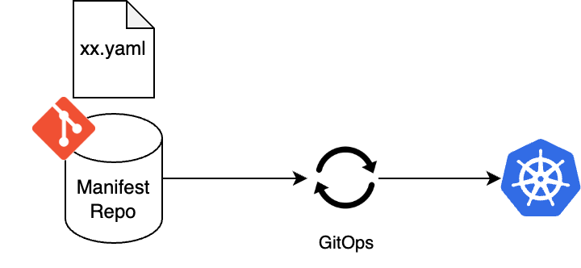
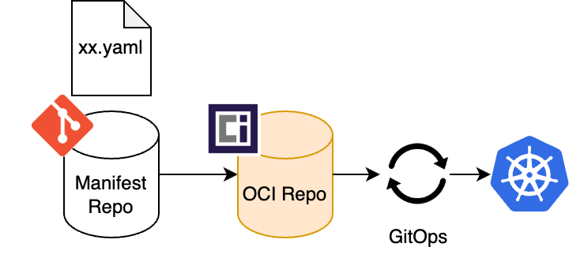
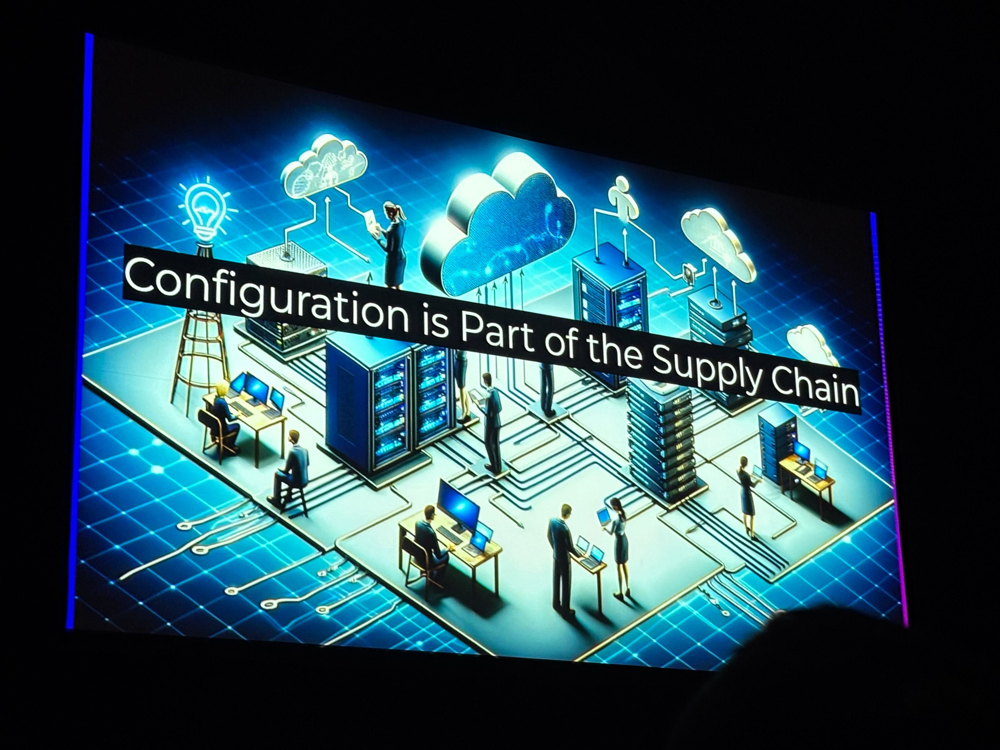
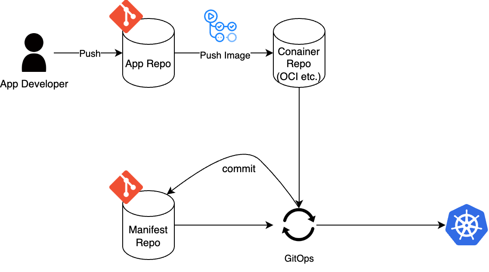
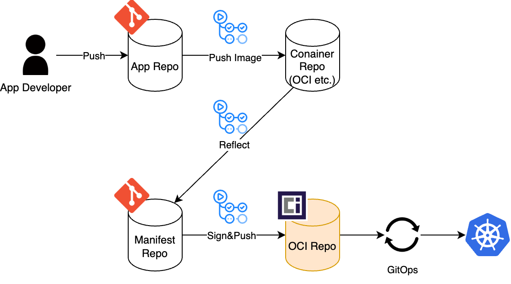

_This article is translated and edited from [my own article in Japanese](https://zenn.dev/cadp/articles/gitless-gitops-intro)._

I learned about **Gitless GitOps** at [KubeCon EU 2025](https://events.linuxfoundation.org/kubecon-cloudnativecon-europe/). As a developer of a GitOps tool ([PipeCD](https://pipecd.dev/)), I was intrigued but found limited information available, so I decided to investigate.

"_GitOps without Git? How does that work?_"

You can read the details in this report. Gitless is introduced as part of D2, Flux's reference architecture, so you don't need to read the entire document.

https://fluxcd.io/guides/d2-architecture-reference/

## Key Points

- Gitless GitOps is a new GitOps architecture that **centers on OCI Registry instead of Git**
- While it's "Gitless" because GitOps tools don't access Git, the fundamental principles remain largely unchanged
- The main benefit is **enhanced security in the supply chain**

## Review: Current GitOps

### What is GitOps?

GitOps is a delivery method that "keeps the production environment in sync with Git configuration."
It follows these [4 principles](https://opengitops.dev/):
1. Declarative
2. Versioned and Immutable
3. Pulled Automatically
4. Continuously Reconciled

Popular GitOps tools include [ArgoCD](https://argo-cd.readthedocs.io/), [FluxCD](https://fluxcd.io/), and [PipeCD](https://pipecd.dev/).

### Simple GitOps Architecture

Here's a simple GitOps architecture:

The GitOps tool (like FluxCD) continuously monitors the Git repository and deploys changes to the production environment when detected.

## Overview of Gitless GitOps

Gitless GitOps is a delivery method **driven by OCI (Open Container Initiative) artifacts stored in container registries** instead of Git repositories.

CI creates and pushes OCI artifacts, while the GitOps tool focuses solely on applying them.
Continuous reconciliation is based on OCI artifacts rather than Git.

Note that Git remains the Single Source of Truth in Gitless, but mechanisms to maintain consistency between Git and OCI registries through write control are necessary.

This is unrelated to the tool called "Gitless": https://gitless.com/

### Side Note: When Did It Emerge?

As far as I researched, the concept and term "Gitless" appears to have been led by FluxCD developers within the last 3 years.

- 2022: Flux added OCI support (`OCIRepository` introduced)
  - https://fluxcd.io/blog/2022/10/cncf-talk-flux-oci/

- 2024: The term "Gitless GitOps" was already introduced

  - https://www.heise.de/en/background/Gitless-GitOps-The-path-to-a-secure-app-environment-with-Flux-and-OCI-9811957.html

- April 2025: [ControlPlane](https://control-plane.io/) released a reference architecture based on Gitless GitOps
  - ControlPlane is a company providing enterprise solutions for FluxCD and other tools
  - https://control-plane.io/posts/d2-reference-architecture-guide/

There seems to be variation in spelling between "Gitless" and "Git-less".

## Benefits of Gitless

The underlying context for these benefits seems to be that "Git itself wasn't designed for GitOps, and OCI registries are more suitable for cloud-native environments."

### Software Supply Chain Security and Compliance

This is the most emphasized benefit.
The [KubeCon session](https://sched.co/1tx8R) included the message "Configuration is Part of the Supply Chain".

Gitless enables the following, with OCI ecosystem integration being a major advantage:

- Manifest authenticity and integrity can be verified through OCI artifact signing/verification
  - Flux uses [cosign](https://github.com/sigstore/cosign)
- Vulnerability scanning can be performed in OCI repositories
- SBOMs can handle manifests as well

**Background**

The increased focus on such measures is driven by regulations including:
- US: [EO14028 "Executive Order on Improving the Nation's Cybersecurity"](https://www.nist.gov/itl/executive-order-14028-improving-nations-cybersecurity) issued in 2021
- Europe: [Cyber Resilience Act (CRA)](https://digital-strategy.ec.europa.eu/en/policies/cyber-resilience-act) enacted in 2024

### No Git Access Required

Eliminating git pull means network access, authentication, and permissions for Git are no longer needed by GitOps tools.
As [mentioned later](#simplification-of-gitops-tools), write permissions to Git also become unnecessary.

- Can authenticate to OCI registries using Workload Identity without PATs or SSH keys
  - No need for secret management or rotation
- Likely improves Git access permission management efficiency
  - Prevents scenarios like "Strict Git access control inadvertently restricted GitOps tool permissions, breaking Image Updater functionality"

### Performance

Gitless focuses on pulling OCI artifacts instead of git pull, potentially leading to lighter and faster operations.

Current GitOps can face performance challenges with large manifest repositories or frequent updates from trunk-based development. This is because GitOps tools frequently perform git pull and create local copies of pulled repositories.

Various GitOps tools implement performance tuning for git operations, but some aspects remain challenging to optimize, such as identifying which manifests are linked to applications due to templating. Here's an example from PipeCD:

https://pipecd.dev/blog/2024/09/11/performance-improvement-in-git-operations-on-pipecd-v0.48.9/

### Simplification of GitOps Tools

While CI's role expands, the GitOps tool's responsibilities are reduced and simplified. GitOps tools focus solely on "deploying OCI artifacts."

**[1] Templating Processing**

Since CI executes kustomize, jsonnet, etc., and uses the results as OCI artifacts, templating processing becomes unnecessary in CD. The final manifests to be applied can be fixed regardless of GitOps tool versions or dependencies.

Flux's documentation mentions that [OCI artifact-centric approaches are particularly convenient when final manifests aren't in Git due to templating](https://fluxcd.io/flux/cheatsheets/oci-artifacts/#how-does-flux-oci-work).

**[2] Automatic Image Updates**

Various GitOps tools have mechanisms to automatically deploy new application versions. All involve GitOps tools committing to manifest repositories themselves:
- FluxCD: [Image Reflector Controller & Image Automation Controller](https://fluxcd.io/flux/guides/image-update/)
- ArgoCD: [Image Updater](https://argocd-image-updater.readthedocs.io/en/stable/)
- PipeCD: [EventWatcher](https://pipecd.dev/docs/user-guide/event-watcher/)

In Gitless, these responsibilities shift from GitOps tools to CI. This eliminates the need for Git write permissions for GitOps tools.

Here's the Before/After of the overall CI/CD pipeline including image updates:

_Current architecture:_

_Gitless architecture:_

### Potentially Good for Edge Environments?

While not mentioned in ControlPlane's report, some suggest that replicating OCI repositories across locations could enable fast, stable deployments in edge environments.

https://itnext.io/advantages-of-storing-configuration-in-container-registries-rather-than-git-b4266dc0c79f

## What's Needed to Migrate to Gitless?

Here are some necessary tasks for migrating to Gitless. Both GitOps tool users and developers need to make adjustments.

### User-side Tasks

- Reflect application image pushes in the manifest repository
- Create, sign, and push OCI artifacts from the manifest repository
- Modify GitOps tool configuration to monitor OCI artifacts instead of Git
  - Git access permissions and network access for GitOps tools can be removed

### Developer-side Tasks (Already Implemented in Flux)

- Support OCI registry monitoring, retrieval, and signature verification
  - For Flux, the main task was adding [`OCIRepository`](https://fluxcd.io/flux/components/source/ocirepositories/) to [SourceController](https://fluxcd.io/flux/components/source/), which appears to be cleanly implemented
- Support OCI artifact deployment
  - Since manifest apply functionality should already exist, mainly needs artifact extraction processing

ArgoCD is currently [working on implementation](https://github.com/argoproj/argo-cd/issues/17564), while PipeCD hasn't started yet.

For implementation, the OCI artifact manipulation client tool [ORAS](https://oras.land/) (CNCF Sandbox project) seems useful. [Flux uses oras-go](https://github.com/fluxcd/source-controller/blob/v1.5.0/internal/oci/notation/notation.go).

## Conclusion

FluxCD's pioneering presence is impressive.

Should everyone adopt Gitless? "Not everyone at this point" is my answer. While GitOps tools currently handle many tasks, Gitless requires additional CI setup.
However, Gitless could be powerful in industries and countries requiring strict security and compliance.

The momentum of Gitless likely depends on the strictness of software supply chain security regulations and the emergence of large-scale GitOps performance case studies.

_While writing this article, [unsettling news about CVE program continuity](https://www.thecvefoundation.org/) emerged, causing some concern_
