# AWS (p)re:Invent 2024 recap

- re:Invent直前にも多くのUpdatesが発表されていたので、それも一部含めて列挙しています
  - "**p**re:Invent"と呼ばれる
- 網羅性はないです
  - AIはほぼ取り上げません
  - 網羅的な解説:
    - YouTube: https://www.youtube.com/watch?v=XhUemgp7LHo
  - 全セッション文字起こし:
    - https://docs.google.com/spreadsheets/d/1T33y-w0R7VSgNHPKdwLlTp79Z69kkUNac73B06M98EQ/edit?gid=0#gid=0
- previewラベルはつけ忘れもあります
- 合計35点のUpdatesを紹介します

# 目次

- 全体総括
- re:Inventの目玉のUpdates 4点
- コンテナ・O11y関連のUpdates
- その他個人的に注目のUpdates

# 全体総括

- re:Invent本期間で大きなアップデートがあったのは、主にAI,DB,ストレージ
  - それ以外はほとんどpre:Inventでのアップデート
- pre:Invent含めると、DataLake, Observability, CDN関連のアップデートが多い。外部SaaSに金取られすぎだから？

# re:Inventの目玉のUpdates 4点

### Aurora DSQL

https://aws.amazon.com/jp/blogs/news/introducing-amazon-aurora-dsql/

- サーバレス分散SQL DB
- Spannerの4倍速いらしい
- 楽観的同時性制御により、ロック待ちをなくしている
  - 一方で、リトライ処理は必要
- 事実上無制限のスケーラビリティ
- マルチリージョンで強い整合性(Active-Activeな書き込み)
- PostgreSQL互換
- グローバルなサービスに限らず、単一リージョンのサービスにも使える
- Aurora Limitless Databaseとは色々異なる
  - https://speakerdeck.com/maroon1st/re-growth-2024-aurora-dsql-wotiyantohua-simasu?slide=14

### S3 Tables

https://aws.amazon.com/jp/blogs/aws/new-amazon-s3-tables-storage-optimized-for-analytics-workloads/

- 分析向けの新しいストレージオプション
- Apache Iceberg形式のデータを保存し、Athena/EMR/Sparkなどから簡単にクエリできる
- [前提知識] Apache Icebergとは
  - 大規模分析に適したオープンソースのテーブルフォーマット
  - Spark, Trinoなどの多様なエンジンから利用できる
  - 詳細はこちら
    - https://bering.hatenadiary.com/entry/2023/09/24/175953
- 背景含めた詳細はこちら
  - https://zenn.dev/kiiwami/articles/febd2d45ea0ea290

### S3 Metadata (preview)

https://aws.amazon.com/jp/blogs/aws/introducing-queryable-object-metadata-for-amazon-s3-buckets-preview/

- S3オブジェクトの追加時/変更時に、自動でメタデータを生成し、Icebergテーブル(S3 Tables)に保存する
- S3内の大量オブジェクトの中から、特定の条件を満たすオブジェクトを効率的に探せるように
- カスタムのメタデータも付与できるため、「ユーザIDや地域による絞り込み」も可能
- Recognition(画像認識サービス)と組み合わせると、「猫が写ってる画像だけ絞り込み」なども可能

### 新AIモデル Amazon Nova 登場

https://www.aboutamazon.com/news/aws/amazon-nova-artificial-intelligence-bedrock-aws

- 競合と同程度の性能で、75%安価らしい

# コンテナ・O11y関連のUpdates

ECS,EKS,CloudWatchだけ取り上げます。

## ECS

ECSだけは全アップデートをカバーしたはず

### ECSのServiceバージョニングとデプロイ履歴を導入

https://aws.amazon.com/about-aws/whats-new/2024/11/service-versioning-deployment-history-amazon-ecs-services/

- ECSのデプロイ情報をより詳細に閲覧できるようになった（コンソール、API）

←従来 | 新→

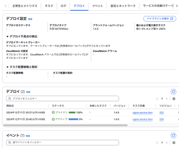 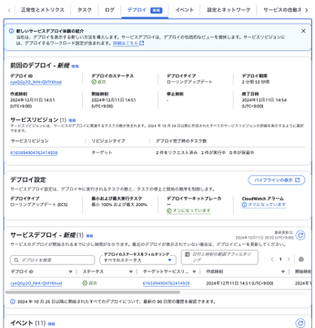

- PipeCD的には使うことなさそう
- PipeCDが使っている「外部デプロイタイプ」はサポートされていない...

### ECSがVPC Latticeと統合

- ECS ServiceをVPC LatticeのTarget Groupに紐づけられるようになった

https://aws.amazon.com/about-aws/whats-new/2024/11/amazon-vpc-lattice-elastic-container-service/

- [前提知識] VPC Lattice：　ALBを抽象化し、あらゆるアプリケーションを簡単に接続できる機能
- 従来は、VPC Latticeに紐づけるために、ALBが必要だった

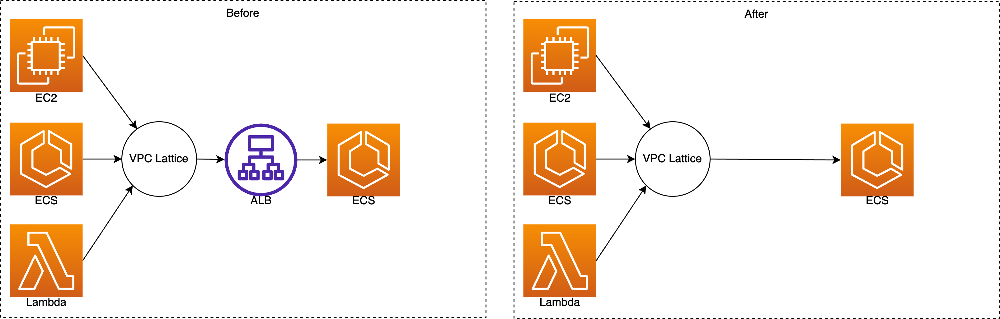

### ECSでバージョン一貫性をオフにできるように

https://aws.amazon.com/about-aws/whats-new/2024/11/amazon-ecs-configure-software-version-consistency/

- [前提知識] バージョン一貫性とは:
  - 2024年7月から強制的に適用された
  - サービス内のすべてのタスクが、必ず同一のイメージダイジェストから起動されるようになった
  - 「latestタグを参照していたら、後から実際のイメージが変更され、スケールアウト時に異なるイメージが使われてしまう」ような問題を解消できる
- バージョン一貫性の導入により、既存の挙動に依存していたデプロイ戦略が崩れていた
  - 例）「latestでpushされ次第、各タスク定義が次回からそのイメージを使ってデプロイする」
  - Roadmap上では、「強制ではなくオプトインにしてほしかった」声がちらほら

### ECS AZ間の自動リバランシング

https://aws.amazon.com/about-aws/whats-new/2024/11/amazon-ecs-az-rebalancing-speeds-mean-time-recovery-event/

- AZ障害時などに、ECS TaskをAZ間で自動リバランスできるようになった
- これにより、リカバリーイベント時の平均復旧時間(MTTR)が短縮される

### ECS 予測スケーリング

https://aws.amazon.com/about-aws/whats-new/2024/11/predictive-scaling-for-amazon-ecs-services/

- 定期的/予測可能なピークに対して、自動でスケールさせられるようになった
- スケジュールスケーリングとは異なり、「いつスケールさせるか」を分析・設定する必要がない点が強み
- 機械学習で需要予測してる
- EC2ではサポート済

https://docs.aws.amazon.com/autoscaling/ec2/userguide/ec2-auto-scaling-predictive-scaling.html

### CloudWatch Container Insight でECS向けの強化されたモニタリング機能をGA

https://aws.amazon.com/about-aws/whats-new/2024/12/amazon-cloudwatch-container-insights-observability-ecs/

- クラスターやサービス、タスクなどのレベルごとにリソース消費量を可視化。ドリルダウンもできる
- 従来はクラスター/サービスレベルまでだった上に、ダッシュボードが一元的ではなかった
- EC2/Fargate 両方をサポート
- EKSでは2023年11月にサポート済み

## EKS

### EKS Auto Mode登場 (よくわかってない)

https://aws.amazon.com/jp/about-aws/whats-new/2024/12/amazon-eks-auto-mode/

- K8sの運用負荷を大幅に軽減
- 様々なアドオンの管理が不要になる
- EKS Auto Mode vs EKS on Fargate
https://qiita.com/takahash_3/items/79487ac82d166e1ec47f

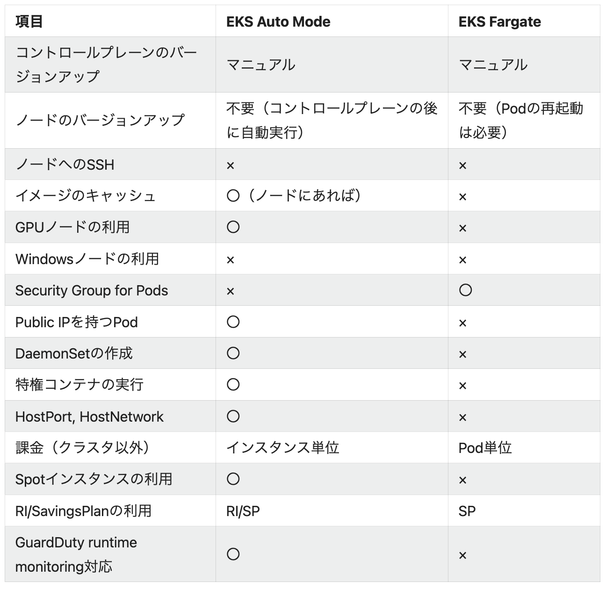

- 参考
  - https://x.com/otty246/status/1863850178362658844$$
  - https://zenn.dev/kiiwami/articles/0192561458ad0e24

### EKS Hybrid Nodes登場

https://aws.amazon.com/jp/blogs/aws/use-your-on-premises-infrastructure-in-amazon-eks-clusters-with-amazon-eks-hybrid-nodes/

- オンプレ/エッジで稼働するサーバをEKSクラスタのNodeとして利用可能
- K8sコントロールプレーンはAWS上でマネージドに実行される
- EKS Anywhereとの相違点
  - [前提知識] EKS Anywhere: EKSで使われてるK8sディストリビューションをEKS外でも使える（＝全然Managedじゃない）
  - EKS AnywhereはAWS接続なしでも使える
  - EKS Hybrid NodesはAWS接続必須。接続の安定性が必要だが、メリットとしてコントロールプレーンの運用が不要

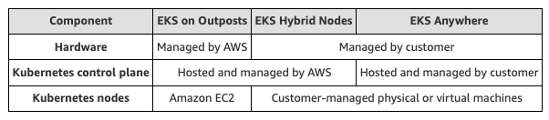

- 詳しくはこのスレッドで

https://x.com/otty246/status/1864138292654166448

## CloudWatch

25件以上あるので、一部を抜粋。

### CloudWatchがオブザーバビリティソリューションを提供開始

https://aws.amazon.com/jp/about-aws/whats-new/2024/11/amazon-cloudwatch-observability-solutions-aws-services-workloads/

- ワークロードのo11yを高めるガイド＋クイックスタート

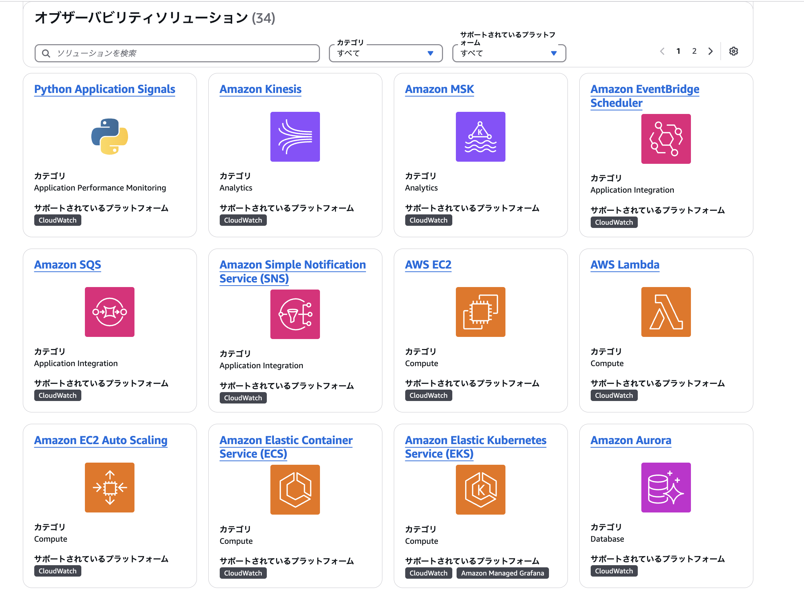
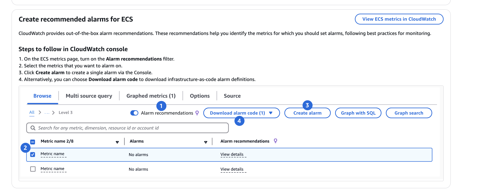

### CloudWatch Application SignalsがSLOのバーンレートをサポート

https://aws.amazon.com/jp/about-aws/whats-new/2024/11/application-signals-burn-rate-application-performance-goals/

- [前提知識] CloudWatch Application Signalsとは:
  - OTel互換のSLO管理機能。
  - SLI/SLOを定義でき、計装・ダッシュボード作成は自動
  - 2024年6月にGA
  - 対象: EKS, ECS, EC2, +Lambda(次項)
- エラーバジェットの消費が速い時などにアラートを出せるように

### LambdaがCloudWatch Application Signals経由でのAPMに対応

https://aws.amazon.com/jp/about-aws/whats-new/2024/11/aws-lambda-application-performance-monitoring-cloudwatch-signals/

- Lambdaも簡単にSLO監視できるように

### CloudWatch Application Signalsがランタイムメトリクスをサポート

https://aws.amazon.com/jp/about-aws/whats-new/2024/11/amazon-cloudwatch-application-signals-runtime-metrics/

- GCの状況やヒープメモリ利用量なども閲覧可能に
- 従来は、インフラレベルのメトリクスのみだった
- Java, Pythonのアプリケーションに対応

### CloudWatch Logsが取込時にフォーマット変換や属性追加をサポート

https://aws.amazon.com/about-aws/whats-new/2024/11/amazon-cloudwatch-logs-transform-enrich/

- 独自の変換パイプラインを組まずとも、多様なデータソースからのログのフォーマットを整えられるように

### CloudWatch Database Insights登場

https://aws.amazon.com/jp/blogs/news/new-amazon-cloudwatch-database-insights-comprehensive-database-observability-from-fleets-to-instances/

- Auroraの統合モニタリング機能
- 既存の Performance Insights(RDS/Aurora), CloudWatch Logs, CloudWatch Application Signals などを統合
- AuroraのPostgreSQL,MySQLに対応

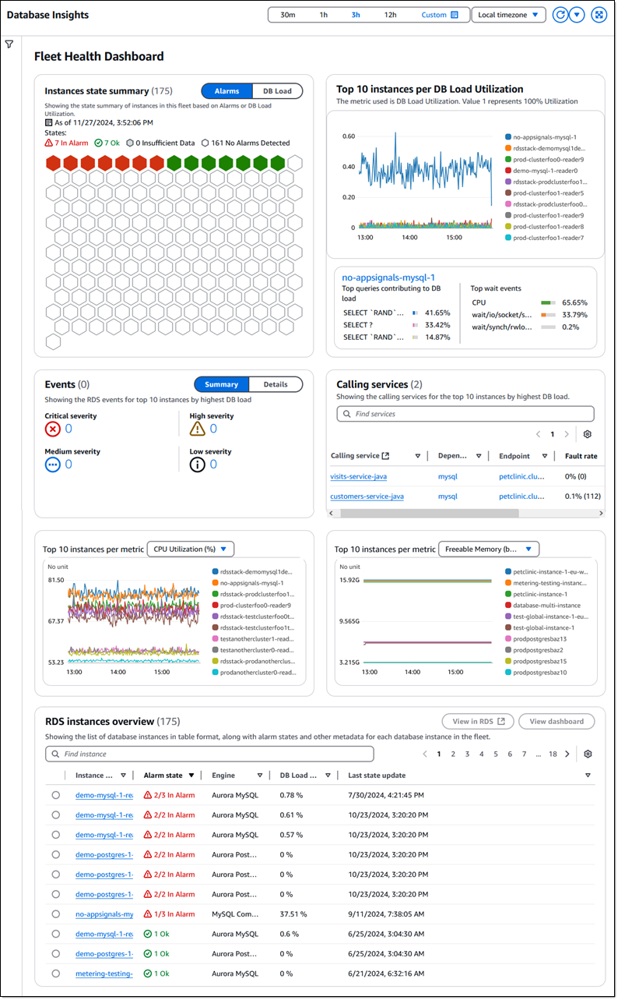

### CloudWatchでフローモニタを利⽤したネットワークパフォーマンス監視をサポート

https://aws.amazon.com/jp/about-aws/whats-new/2024/12/amazon-cloudwatch-network-monitoring-workloads-monitors/

- AWSリソース間のTCPトラフィックのメトリクスをリアルタイムに可視化
- 監視対象にAgentの追加が必要
- 類似機能との違い
  - VPCフローログ
    - IPトラフィックを扱い、主に到達性・到達量の監視に用いる
  - CloudWatch Internet Monitor
    - AWSアプリとエンドユーザ間のネットワーク性能を監視
  - CloudWatch Network Synthetic Monitor
    - ハイブリッドネットワーク（Direct Connect, Site-to-Site VPN）でのEnd-to-Endの性能監視

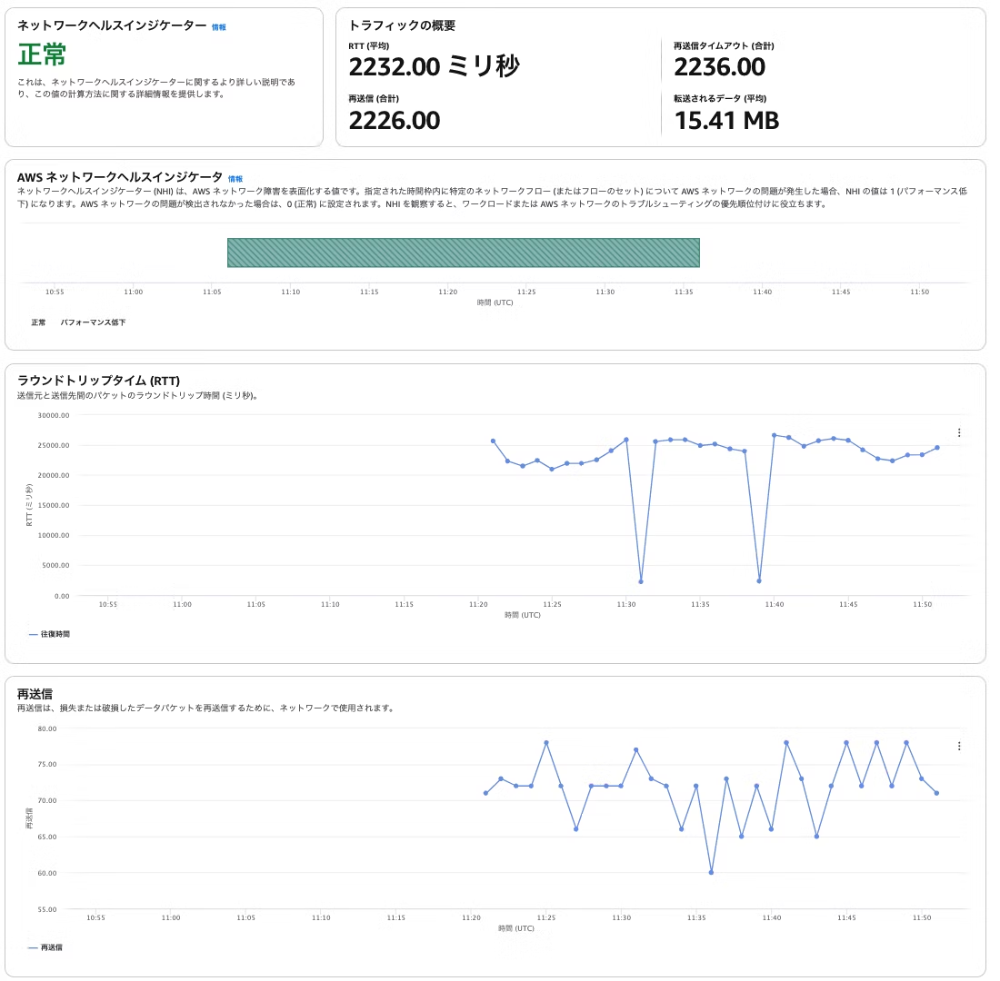
https://qiita.com/kazuki-hara/items/5ef8bdc96b023f57c3de

# その他個人的に注目のUpdates

## ネットワーク

### Block Public Access for VPC

https://aws.amazon.com/jp/about-aws/whats-new/2024/11/block-public-access-amazon-virtual-private-cloud/

- VPC-インターネット間の通信を全てブロックできる
  - ブロック方向は 双方向 or Ingressのみ で選べる
- セキュリティ、コンプライアンス観点で強力

### ALBがヘッダー編集をサポート

https://aws.amazon.com/jp/about-aws/whats-new/2024/11/aws-application-load-balancer-header-modification-enhanced-traffic-control-security/

- 3機能からなる
  - ヘッダーのリネーム
    - バックエンド側をあまり修正せずとも、ALBが自動生成するTLSヘッダーをバックエンドに合うフォーマットに変換できるように
  - レスポンスヘッダーの挿入
    - CORSやHSTS(HTTP Strict-Transport-Security)などのヘッダーを追加できるように
  - レスポンスのサーバヘッダーの無効化
- アプリケーション修正ではなくALB側の設定変更でセキュリティ向上可能に

### ALB/NLBの最小キャパシティを指定可能に

https://aws.amazon.com/jp/about-aws/whats-new/2024/11/load-balancer-capacity-unit-reservation-application-balancers/

- オートスケールでは間に合わないアクセススパイクの備えられるように
- 従来はサポート経由で「暖気申請」が必要だった

### VPC LatticeがTCPをサポート

- アップデートにより、RDS/カスタムDNS/IPエンドポイントなども接続可能になった
- 従来はTLS, HTTP, HTTPSのみで、L7特化の接続サービスだった

https://aws.amazon.com/jp/about-aws/whats-new/2024/12/vpc-lattice-tcp-vpc-resources/

### CloudFront VPC origins

https://aws.amazon.com/jp/about-aws/whats-new/2024/11/amazon-cloudfront-vpc-origins/

- CloudFront経由で、**Private** Subnet内の ALB/NLB/EC2インスタンスからコンテンツ配信が可能になった
  - 従来はPublic SubnetにALB/NLBが必要であり、アクセス制御も面倒だった

### CloudFront gRPC呼び出しをサポート

https://aws.amazon.com/jp/about-aws/whats-new/2024/11/amazon-cloudfront-supports-grpc-delivery/

- gRPCアプリケーションをより低遅延・セキュアに提供可能に

## DB、ストレージ、Analytics

### Aurora Serverless v2がゼロスケールに対応

https://aws.amazon.com/about-aws/whats-new/2024/11/amazon-aurora-serverless-v2-scaling-zero-capacity/

- [前提知識] Aurora Serverlessとは:
  - AuroraのDBインスタンス部分がオートスケールする機能
  - ゼロスケール対応
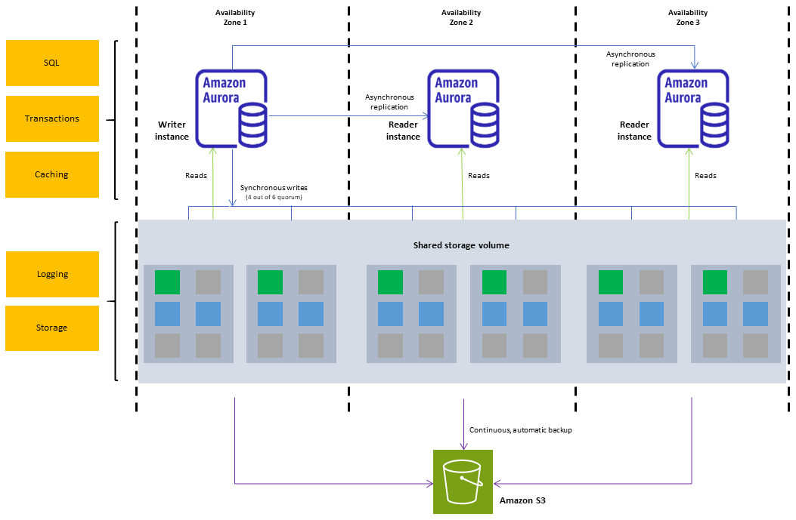
- [前提知識] Aurora Serverless v2とは:
  - 2022年春にGA
  - v1よりも費用・性能・運用面で優れる
- 今回のアップデートにより、v2でも、DBアクセスがないときはインスタンスを0にできる
- 再開には20秒ほどかかるので、dev,staging環境のコスト削減が主な用途になりそう

### DynamoDB Global Tablesがマルチリージョンの強い整合性に対応 (preview)

https://aws.amazon.com/jp/about-aws/whats-new/2024/12/amazon-dynamodb-global-tables-previews-multi-region-strong-consistency/

- 読み取ったデータは必ず最新に
- Aurora DSQLと同じ基盤技術を活用している

### S3バケット数上限が1アカウントあたり1万から100万まで拡大

https://aws.amazon.com/jp/about-aws/whats-new/2024/11/amazon-s3-up-1-million-buckets-per-aws-account/

- S3 Tablesなど、LakeHouse関連のためにこのアップデートが入った？

### Oracle Database@AWS (limited preview)

https://aws.amazon.com/jp/about-aws/whats-new/2024/12/oracle-database-aws-limited-preview/

- オンプレOracleをAWS上に簡単に移行可能に
- 従来は、RAC(高可用性構成)を組むにはEC2上で自前構築が必要だった
  - RDS for OracleはRAC非対応

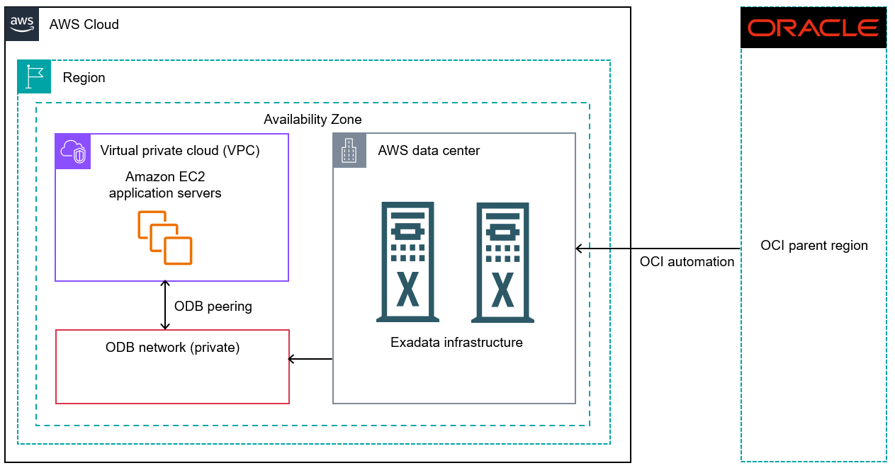

https://docs.aws.amazon.com/odb/latest/UserGuide/what-is-odb.html

### AWS Data Transfer Terminal

https://aws.amazon.com/jp/about-aws/whats-new/2024/12/aws-data-transfer-terminal-high-speed-data-uploads/

- ユーザがAWSの専用ビル（ターミナル）に立ち寄ってデータをAWSに送れる
- ネットワーク越しよりもはるかに高速
- ターミナルはロサンゼルスとニューヨークに開設済。今後世界規模で拡大予定。

### 次世代のSageMaker

https://aws.amazon.com/jp/about-aws/whats-new/2024/12/next-generation-amazon-sagemaker/

- AI・アナリティクス・データを統合したプラットフォームに
- 従来のSageMakerはMLが中心だった

### Amazon Q Developerが運用調査支援を追加 （Preview）

https://aws.amazon.com/jp/blogs/aws/investigate-and-remediate-operational-issues-with-amazon-q-developer/

- Qが問題の原因調査や解決案の提示を手伝ってくれる
- CloudWatchやLambdaなどのサービス、Qチャットなどから調査開始できる
- 下記リンクから、サンプルを確認できる（事前にAWSコンソールにログインしてください）
  - https://us-east-1.console.aws.amazon.com/cloudwatch/home?region=us-east-1#investigations/sample-investigation
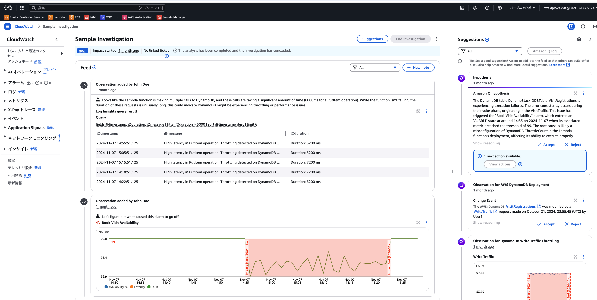

### Databricks on AWSの合理化されたデプロイ方式 提供開始

https://aws.amazon.com/jp/about-aws/whats-new/2024/12/streamlined-deployment-experience-databricks-aws/

- DatabricksをAWS上でより簡単に開始可能に

## その他

### CloudFormationでデプロイのタイムラインを可視化

https://aws.amazon.com/jp/blogs/news/peek-inside-your-aws-cloudformation-deployments-with-timeline-view/

- CloudFormationのデプロイ時に「どの処理にどれだけ時間がかかったか」をグラフで可視化

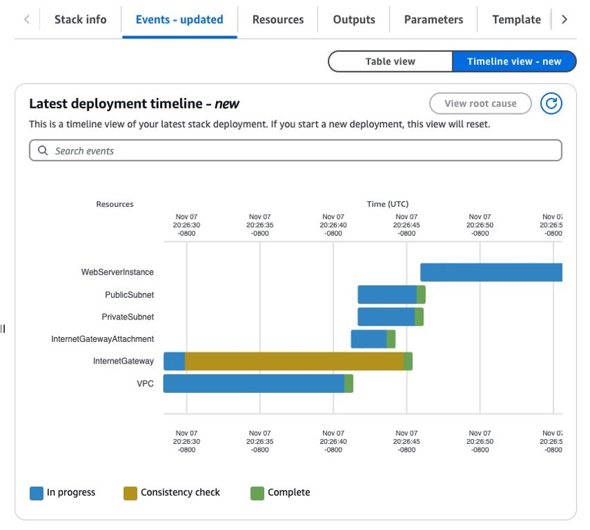

### AWS Security Incident ResponseがGA

https://aws.amazon.com/jp/blogs/aws/new-aws-security-incident-response-helps-organizations-respond-to-and-recover-from-security-events/

- セキュリティイベントへの準備・対応・復旧に対する有人⽀援
- 月額最低$7,000
